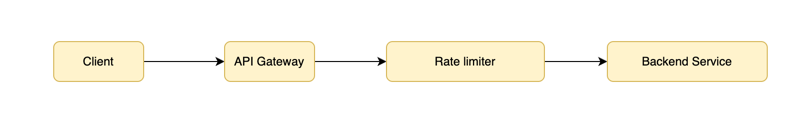

# Rate Limiter #

**Table Of Contents**
<!-- TOC -->
    * [Problem Statement](#problem-statement)
    * [Functional Requirements](#functional-requirements)
    * [Non Functional Requirements](#non-functional-requirements)
    * [Architecture](#architecture)
    * [Class Diagram](#class-diagram)
<!-- TOC -->

### Problem Statement

Design a Rate limiter that 
* Restrict the number of request a User can Make
* Work Effectively at scale

### Functional Requirements
Limits Requests per
* User-ID
* API Key
* IP

Configurable Limits
Should Allow or Deny Request in Real time

### Non Functional Requirements
* Low Latency
* High Availability
* Scalable
* Fault Tolerant

### Architecture



**Flow**
* Client Send Request
* API Gateway forward the request to Rate limiter
* Rate limiter:
  * Checks Request Count
  * Allow / Reject Request
* Allowed : Forward the request to Backend
* Denied : return 429 - Too many requests

### Low Level Design 

Approach

* Bucket holds Tokens
* Tokens refill at fixed rates.
* Each Request COnsumes one token


```java
class TokenBucket {
    int capacity;
    double tokens;
    double refillRate; // tokens per second
    long lastRefillTime;
}
```
**Flow**
```java
if(token >=1) 
    allow request;
    token--;
else deny request
```

### Class Diagram

```markdown
                +---------------------+
                | RateLimiter         |  (Interface)
                +---------------------+
                | allowRequest()      |
                +----------+----------+
                           |
        +------------------+------------------+
        |                                     |
+---------------------+          +-------------------------+
| TokenBucketLimiter  |          | SlidingWindowLimiter    |
+---------------------+          +-------------------------+
| capacity            |          | request log (timestamps)|
| refillRate          |          +-------------------------+
| tokens              |
| lastRefillTime      |
+---------------------+

                +----------------------+
                | RateLimiterFactory   |
                +----------------------+
```